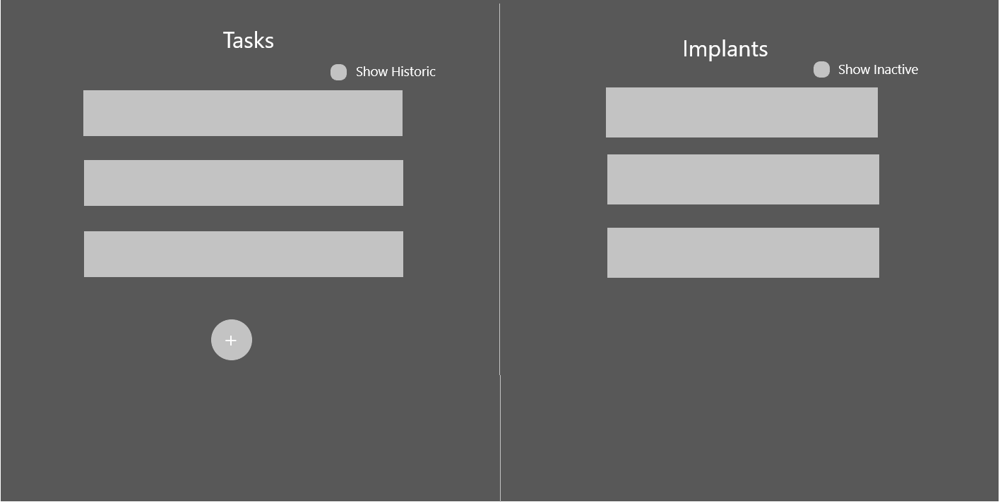

# UI Design

The UI will be designed such that the vast majority of tasks are done from a single page. There will, however be at least one other page, for administrative use.

The main page will look broadly like this:

where the tasks list will be populated once an implant is selected. The "Show Historic" checkbox will determine whether to show tasks which have already been sent to the implant.